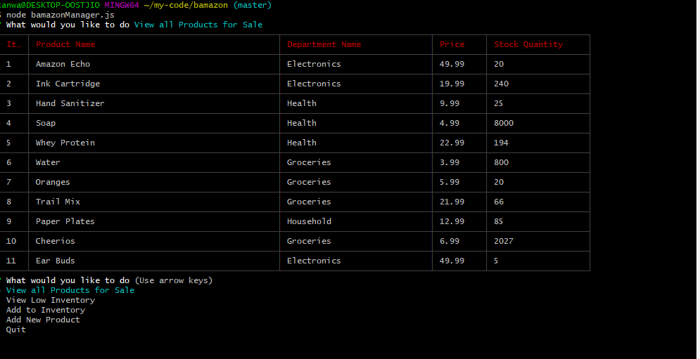

# bamazon

### Bamazon mimic's some of the features to Buy products online at e-commerece sites such as Amazon

  * There are two runtime for the bamazon. One for customer and the other for managers 

###  MySql Database 
    Create the mySql database using the sql script from mysql prompt or mysql workbench - bamazon.sql
    
### bamazonCustomer - Customer Interface of the sales ( at CLI / Bash prompt -->  node bamazonCustomer.js)

    * This allows customers to view online store items
    * It then allows them to purchase any of the items in the list by providing the Item ID and Purchase Quantity

###  bamazonManager - Online store Manager Interface at CLI / Bash prompt -->  node bamazonManager.js)

    * The manager interface provides the Online store manager to do the following

        - View Items for Sale in Store

        - View which item have low inventory

        - Add more Inventory to existing Items in the list

        - Add New Items for Sale

        - Exit the Store Manager interfac
                                

### How was this created

    * The program is a NodeJs javascript backend which currently runs only in command line

    * Built Using

        -  Javascript
        -  Node Package Manager
        -  Bash
        -  3rd Party NPM Packages (inquirer, table-cli-2, mysql )
         
### Examples of commands in action

### Manager View 

